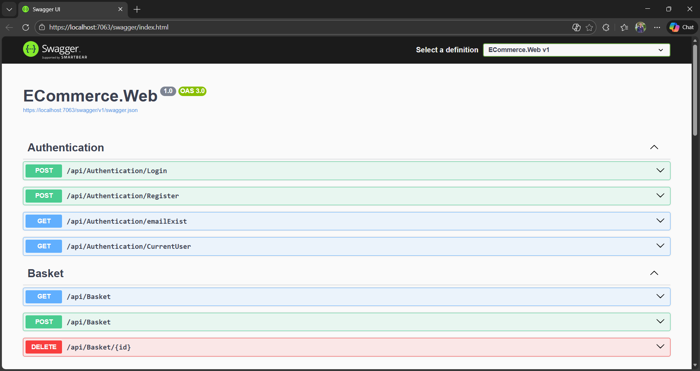
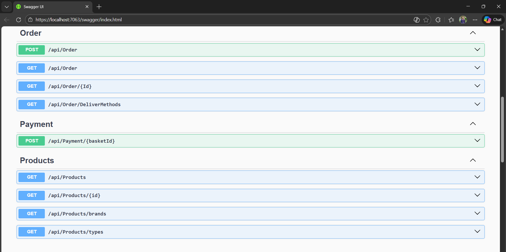
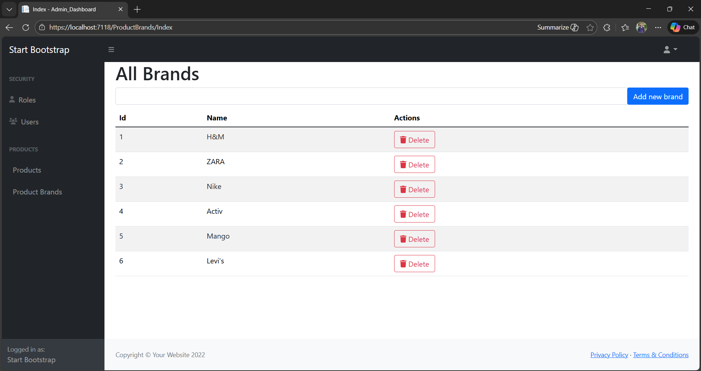

# 🛒 E-Commerce Backend API (.NET)

A robust and scalable **E-Commerce Backend API** built with **ASP.NET Core**, designed using **Clean Architecture** and **Onion Architecture** principles to ensure maintainability, testability, and clear separation of concerns.

The system delivers a complete end-to-end e-commerce workflow including advanced product querying, JWT-based authentication, Redis-powered basket caching, Stripe payment processing, and a dedicated MVC-based Admin Dashboard.

---

# 🚀 Features

## 🔐 Authentication & Security

- JWT Authentication (Bearer Token)
- Secure token generation & validation
- Current authenticated user endpoint
- Email existence validation
- Role-based access control (extensible)

### 📸 Swagger – Authentication & Basket



---

## 🛒 Products, Orders & Payments Workflow

The system implements a complete e-commerce checkout lifecycle:

### 🧾 Product Management
- Products categorized by **Brand** and **Type**
- Advanced querying:
  - Filter by `BrandId`
  - Filter by `TypeId`
  - Search by product name
- Sorting:
  - Name (ASC / DESC)
  - Price (ASC / DESC)
- Pagination with configurable page size (max limit enforced)

Powered by:
- Specification Pattern
- Repository Pattern

---

### 🛍 Basket (Redis Powered)
- Shopping basket stored in **Redis**
- Fast access & performance optimization
- Persistent per-user basket storage
- Reduced database load via distributed caching

---

### 📦 Order Processing
- Create orders from an authenticated user's basket
- Persist:
  - Order items
  - Delivery method
  - Subtotal & total price calculation
- Order lifecycle:
  - Pending
  - Payment Received
  - Failed
- Retrieve orders:
  - By authenticated user
  - By order ID

---

### 💳 Stripe Payment Integration
- Stripe Payment Intent creation
- Secure client secret generation
- Payment confirmation handling
- Automatic order status update after successful payment

Integrated with:
- Unit of Work
- Result Pattern
- Stripe confirmation flow

---

### 📸 Swagger – Products, Orders & Payments



---

# 🖥 Admin Dashboard (MVC)

A separate **Admin Dashboard** project built using ASP.NET Core MVC.

Features:
- Manage Product Brands
- Manage Products
- Manage Roles
- Manage Users

### 📸 Admin Dashboard – Product Brands



---

# 🧠 Architecture & Design Patterns

## 🧅 Onion Architecture (Domain-Centric)

The solution enforces the Dependency Rule and ensures scalability, maintainability, and testability.

---

## Implemented Design Patterns

- Repository Pattern
- Unit of Work Pattern
- Specification Pattern
- Result Pattern (Standardized API responses)
- Factory Pattern (API response & object creation)
- Dependency Injection (ASP.NET Core built-in DI)
- Global Exception Handling Middleware
- Custom Middleware
- LINQ Expressions (Expression<Func<...>>) within Specification Pattern

---

# 🧅 Project Structure

```
ECommerce
│
├── ECommerce.Domain
│   ├── Entities
│   └── Interfaces
│
├── ECommerce.ServicesAbstraction
│   ├── Service Interfaces
│   └── DTO Contracts
│
├── ECommerce.Services
│   ├── Business Logic
│   ├── Factories
│   └── Result Pattern
│
├── ECommerce.Persistence
│   ├── DbContexts
│   │   ├── StoreDbContext
│   │   └── StoreIdentityDbContext
│   ├── Data Seeding
│   └── Repositories
│
├── ECommerce.Web (Web API)
│   ├── Controllers
│   ├── Custom Middlewares
│   ├── Attributes
│   └── Program.cs
│
└── Admin.Dashboard (MVC)
    ├── Controllers
    ├── Views
    └── Identity Integration
```

---

# 🔗 Dependency Rule

- Domain → No dependencies
- ServicesAbstraction → Depends only on Domain
- Services → Depends on Domain & ServicesAbstraction
- Persistence → Depends on Application Core
- Web & Presentation → Depend on all inner layers

This ensures:
- High maintainability
- Testability
- Scalability
- Clear separation of concerns

---

# ▶️ Run the Application

1. Clone the repository
2. Configure database & Redis locally
3. Apply EF Core migrations
4. Run API project
5. Access Swagger UI
6. Run Admin Dashboard project

---

# 📈 Future Improvements

- Refresh Tokens
- Wishlist feature
- Product Reviews & Ratings
- Full Admin Reporting Dashboard

---

# 👨‍💻 Author

**Mark Sameeh**  
Backend .NET Developer  

- 📧 Email: mark.sameeh26@gmail.com  
- 🔗 LinkedIn: https://www.linkedin.com/in/marksameeh  
- 💻 GitHub: https://github.com/mark26504  

---

⭐ If you find this project helpful, feel free to star the repository!
